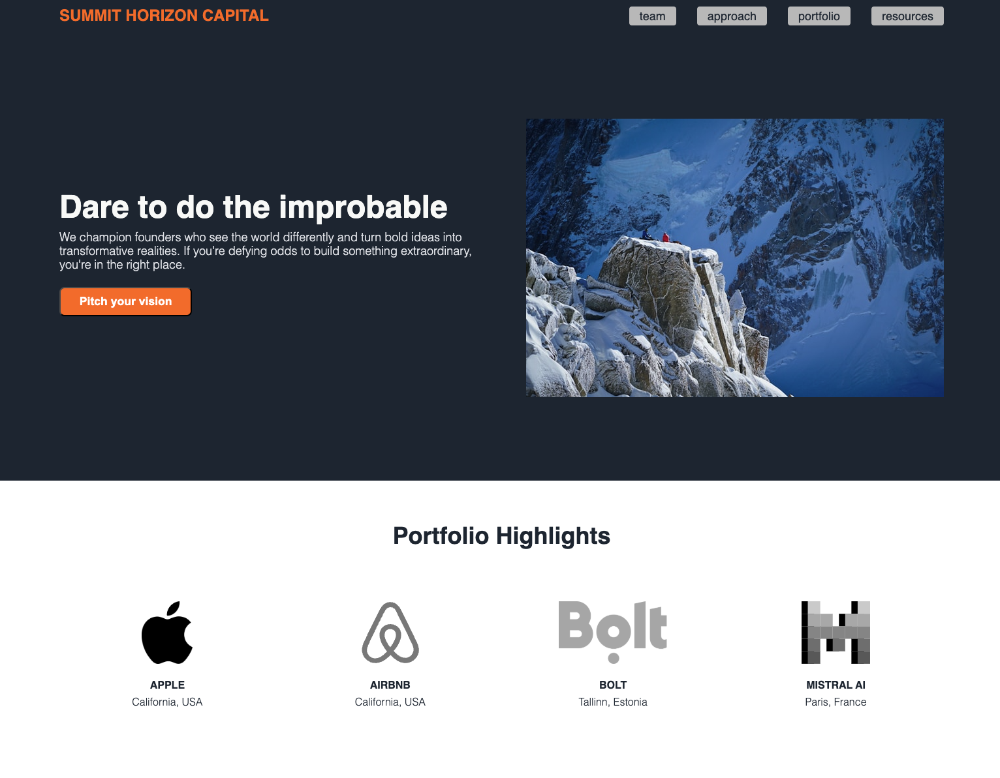

# Venture Fund Landing Page

This is a landing page for *Summit Horizon Capital*, a venture fund dedicated to backing the underdogs who dare to do the improbable. The page showcases the fund's mission, portfolio highlights, and provides a call-to-action for entrepreneurs to pitch their vision.

Credit to the hero image goes to Henry Lim. https://unsplash.com/@henrylim.

Airbnb logo by Alexis Doreau. https://iconscout.com/contributors/alexis-doreau.

---

## Features

- **Hero Section**:  
  - Main slogan: "Dare to do the improbable."  
  - Introduction to the fund's ethos and mission.  
  - A call-to-action button encouraging users to pitch their ideas.

- **Portfolio Highlights**:  
  - A section showcasing high-profile companies in the fund's portfolio such as Apple, Airbnb, Bolt, and Mistral AI.

- **Inspirational Quote**:  

- **Call to Action**:  
  - A section motivating users to "pitch their vision" and join in building the future.

---

## Technologies Used

- **HTML5**: Structure and semantic markup.
- **CSS3**: Styling and layout (via an external stylesheet `styles.css`).

---

## License

This project is licensed under the MIT License - feel free to use, modify, and distribute as needed.

---

## Contact

For any questions or feedback, feel free to reach out via the issue tracker or email at theodor.kaljo@gmail.com.

Enjoy coding! 🚀